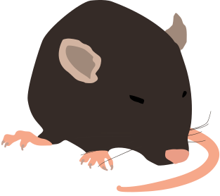
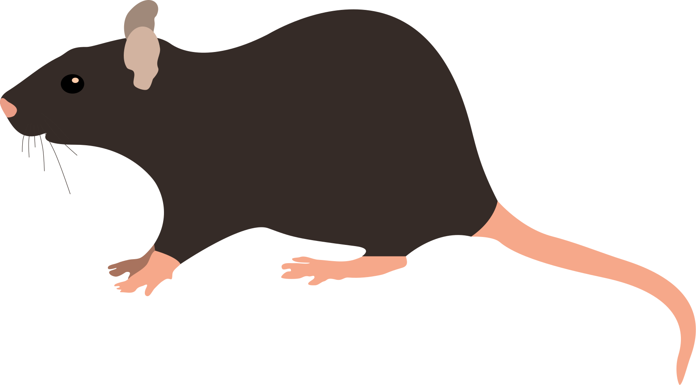
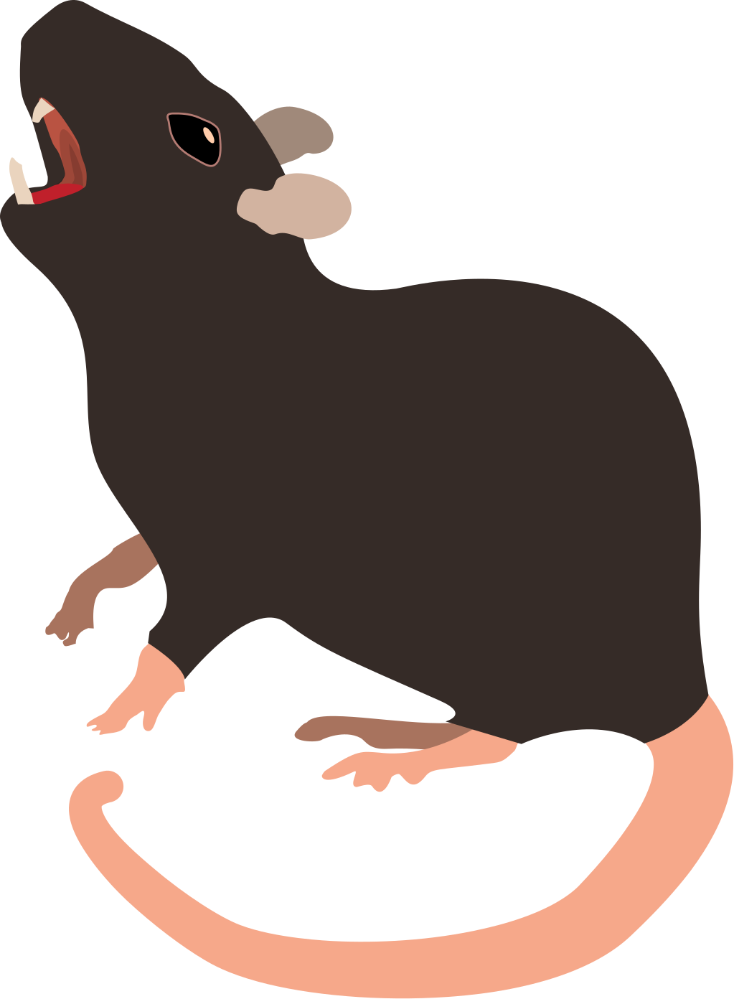
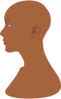
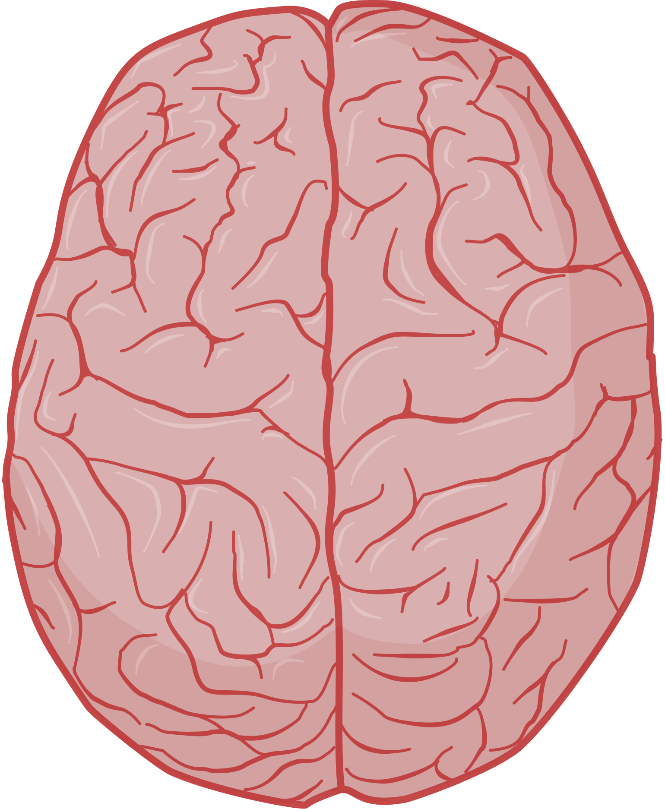
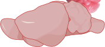
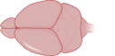

# FigureFodder

This is a collection of free and public domain neuroscience related iconography. All contents of this repository are created by Maxwell Madden and licensed under Creative Commons Zero 1.0 Universal and as such may be _freely used by anyone for personal or commercial purposes without attribution_.

Files are provided in svg format.

# Gallery

## Featured

## Animals

  

  

## Brains

   

## Cortical Networks

  
  
