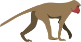
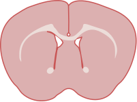

# FigureFodder

This is a collection of free and public domain neuroscience related iconography. All contents of this repository were created by Maxwell Madden and are licensed under Creative Commons Zero 1.0 Universal and as such may be _freely used by anyone for personal or commercial purposes without attribution_.

Files are provided in svg format.

# Gallery

A selection of available iconography is shown below. Explore the repo for additional icons and diagrams.

## Featured

## Animals

  
  

## Brains

   

## Cortical Network Representations

  
  

## Diagrams

    

 

  
